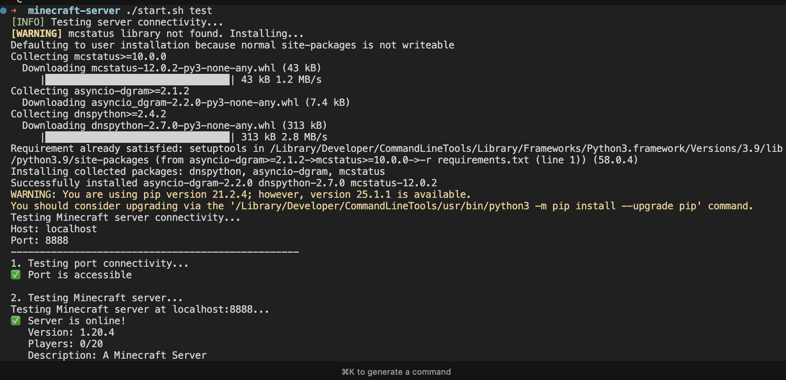

# Minecraft Server Docker

A complete Docker-based Minecraft server setup built from scratch without using pre-built Minecraft images. This project demonstrates containerization of a Minecraft server with persistent storage and configurable settings. The project demonstrates:

- **Custom Docker Image**: Built from Ubuntu base image without using pre-built Minecraft images
- **Manual Server Setup**: Downloads and configures the official Minecraft server binary
- **Persistent Storage**: World data and server configuration persist across container restarts
- **Configurable Environment**: All server settings configurable via environment variables
- **Production Ready**: Includes proper user permissions, error handling, and restart policies

## Table of Contents

1. [Prerequisites](#prerequisites)
2. [Quickstart](#quickstart)
3. [Usage](#usage)
    - [Start the server](#start-the-server)
    - [Create backup](#create-backup)
    - [Restore from backup](#restore-from-backup)
    - [Server connectivity test.](#server-connectivity-test)
    - [Deploy the app to a V-Server](#deploy-the-app-to-a-v-server)
    - [Persistence testing](#persistence-testing)
    - [File descriptions](#file-descriptions)
    - [Manual usage](#manual-usage)
4. [Project Checklist](#project-checklist)

## Prerequisites

- Docker and Docker Compose installed on your system
- At least 2GB RAM available for the server
- Port 8888 available on your system

## Quickstart

With SSH configured (if SSH Keys are provided to GitHub)
```bash
git clone git@github.com:MarcosChavez09/mc-server.git
```
Classic HTTPS (if no SSH Keys are provided to GitHub)
```bash
git clone https://github.com/MarcosChavez09/mc-server.git
```
After cloning the repository, navigate to:

```bash
cd minecraft-server
```

Run the [start.sh](start.sh) script to start the DB and Web containers locally:

```bash
bash start.sh start
```

or
```bash
./start.sh start
```

The `start.sh` script will run the `docker-compose`, create the DB volume, build the Minecraft image, start the DB and the Minecraft server.

The server will be reacheable under http://localhost:8888

> **_NOTE:_** If you visit http://<localhost_or_server_IP>:8888 you will see an **ERR_EMPTY_RESPONSE** message. This is a normal behavior and the reason is, that Minecraft Server does not send any HTTP data to the browser, it only respons to request from Minecraft clients.


To onnect to your server:
   - Open Minecraft client
   - Go to Multiplayer → Add Server
   - Enter your server IP and port 8888

## Usage

To create the Minecraft Sever Docker conatiner you only need to run the `start.sh` script. The script offers the following flags:

| Flag              | Description | example |
| :---------------- | :------ | :---- |
| start        |   Starts the server   | ./start start |
| down           |   Stops the server   | ./start down |
| restart    | Restarts the server   | ./start restart |
| status|  Show server status   | ./start status |
| logs|  Show server status   | ./start logs |
| backup|  Create a world backup   | ./start backup |
| test|  Server connectivity (Uses Python `mcstatus`)   | ./start test |
| help|  Show help message   | ./start help |


### Start the server.
```bash
bash start.sh start
```
or 
```bash
./start.sh start
```

Access server console
```bash
docker-compose exec mc-server bash
```

### Create backup.

Stop the server first:

```bash
bash start.sh down
```
or 

```bash
./start.sh down
```

Backup the data volume:

```bash
docker run --rm -v minecraft-server_minecraft_data:/data -v $(pwd):/backup ubuntu tar czf /backup/minecraft-backup-$(date +%Y%m%d-%H%M%S).tar.gz -C /data .
```

Start the server again:
```bash
bash start.sh start
```
or 
```bash
./start.sh start
```

### Restore from backup

Stop the server first:
```bash
bash start.sh down
```
or 

```bash
./start.sh down
```

Restore‚:
```bash
docker run --rm -v minecraft-server_minecraft_data:/data -v $(pwd):/backup ubuntu tar xzf /backup/backup-file.tar.gz -C /data
```

Start the server again:

```bash
bash start.sh start
```
or 
```bash
./start.sh start
```

### Server connectivity test.

Use the provided Python script to test server connectivity:

```bash
./start.sh test
```

You should see something like this:



### Deploy the app to a V-Server.

1. Login to your V-Server
```bash
ssh -i ~/.ssh/<name_of_your_key> <your_user_name>@<ip_server_address>
```
2. Create a new folder in your `home` directory and clone this repository there
```bash
mkdir -p ~/projects
cd ~/projects
git clone git@github.com:MarcosChavez09/mc-server.git
```

3. Install Docker on your V-Server if you haven't done so yet. 

4. Start the `start.sh` script.
```bash
./start.sh start
```

5. Visit the link `http://<ip_server_address>:8888`

6. Test the server conection using `mcstatus`.
```bash
./start.sh test
```

### Manual Usage.

1. **Start the server**:
   ```bash
   docker-compose up -d
   ```

2. **Check if server is running**:
   ```bash
   docker-compose ps
   ```

3. **Verify port accessibility**:
   ```bash
   netstat -tuln | grep 8888
   ```

4. **Connect with Minecraft client**:
   - Server IP: Your server's IP address
   - Port: 8888

### Persistence testing.

1. **Create some data in the world**
2. **Restart the container**:
   ```bash
   docker-compose restart
   ```
3. **Verify data persistence**:
   - World data should remain intact
   - Server configuration should persist


### File descriptions.

- **Dockerfile**: Custom container that downloads and sets up Minecraft server from scratch
- **docker-compose.yml**: Defines the `mc-server` service with proper configuration
- **README.md**: Comprehensive project documentation
- **.dockerignore**: Excludes unnecessary files from Docker build
- **.gitignore**: Prevents sensitive files from being committed
- **test_server.py**: A Python scrtipt that uses `mcserver` to check the Minecraft server.

## Project Checklist

- 📄 [Checklist (PDF)](docs/checklist.pdf)